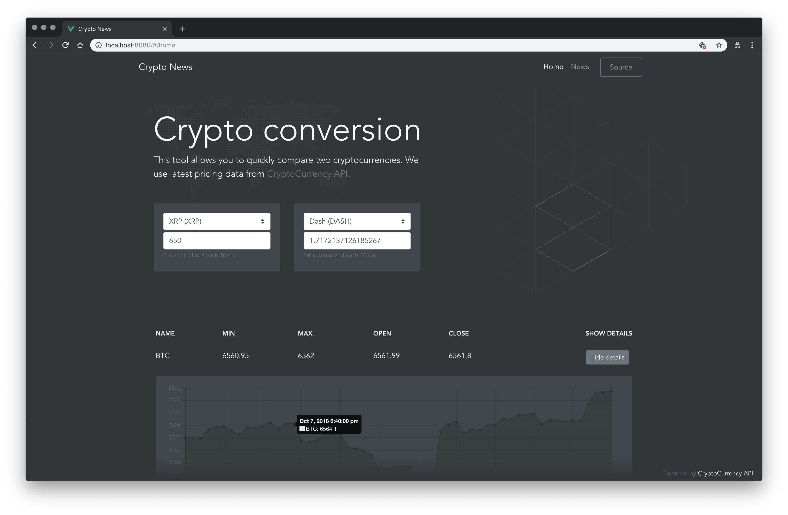

<div align="center">
  <h1>Crypto News</h1>

[](LICENSE)
[](https://github.com/Bartozzz/crypto-news/releases)
<br>

**Crypto News** allows you to converts cryptocurrencies, view latest news and exchange rates for each ICO – all the data from the world of cryptocurrencies in one place. It is based on [`Vue`](https://vuejs.org/), licensed under the _[MIT license](#license)_. Uses [CryptoCompare API](https://min-api.cryptocompare.com/).

  <br>

  
  
</div>

> **Note:** This project was bootstrapped with [`vue-cli`](https://cli.vuejs.org/). Below you'll find information about performing common tasks. The most recent version of this guide is available [here](https://cli.vuejs.org/guide/).

<h2 align="center">Contributing</h2>

### Bug reporting

[](https://github.com/Bartozzz/crypto-news/issues)
[](https://github.com/Bartozzz/crypto-news/issues?q=is%3Aissue+is%3Aclosed)
[](https://github.com/Bartozzz/crypto-news/pulls)

**We want contributing to Crypto News to be fun, enjoyable, and educational for everyone.** Changes and improvements are more than welcome! Feel free to fork and open a pull request. If you have found any issues, please [report them here](https://github.com/Bartozzz/crypto-news/issues/new) - they are being tracked on [GitHub Issues](https://github.com/Bartozzz/crypto-news/issues).

### License

Crypto News was created and developed by [Bartosz Łaniewski](https://github.com/Bartozzz). The full list of contributors can be found [here](https://github.com/Bartozzz/crypto-news/graphs/contributors). Crypto News's code is [MIT licensed](https://github.com/Bartozzz/crypto-news/blob/master/LICENSE). Crypto data is licensed under a [Creative Commons Attribution-NonCommercial 3.0 Unported](https://creativecommons.org/licenses/by-nc/3.0/) license. It is attributed to the [CryptoCompare team](https://www.cryptocompare.com/api/).

### Development

We have prepared multiple commands to help you develop Crypto News on your own. You will need a local copy of [Node.js](https://nodejs.org/en/) installed on your machine. First, you need to clone or [download](https://github.com/Bartozzz/crypto-news/archive/dev.zip) our repository:

```bash
$ git clone --depth=1 https://github.com/Bartozzz/crypto-news.git crypto-news
```

…and install dependencies with npm:

```bash
$ npm install
```

… then run the development server:

```bash
$ npm run serve
```

#### Usage

```bash
$ npm run <command>
```

#### List of commands

| Command | Description |
| ------- | ----------- |
| `serve` |             |
| `build` |             |
| `test`  |             |
| `lint`  |             |
